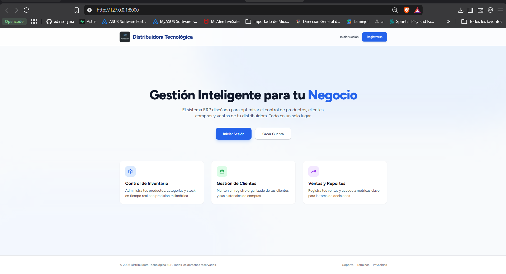

# ERP para Distribuidora Tecnológica

Este proyecto corresponde a una actividad académica del curso **"Software de Gestión Empresarial"**, con el objetivo de implementar y personalizar visualmente el sistema de autenticación de Laravel Breeze, además de desarrollar un entorno funcional CRUD para los módulos de un ERP.

## 📸 Captura de Pantalla: Landing Page

*(Nota: Las demás capturas solicitadas en la rúbrica se encuentran dentro de la carpeta `docs/visual/`)*

## 🎨 Explicación de los Cambios Visuales Realizados

Se realizó un trabajo profundo de rediseño de interfaz de usuario enfocado en convertir el diseño estándar de Laravel Breeze en una experiencia de **software empresarial (ERP) Premium y Moderna**. 

Los principales cambios incluyen:
- **Rediseño Completo del Layout:** Transición de colores planos a un uso estratégico de degradados sutiles (azul profundo corporativo), sombras suaves (shadow-sm, shadow-lg) y tarjetas con bordes redondeados (`rounded-xl` y `rounded-2xl`).
- **Navegación:** Sustitución del menú superior por uno estructurado con módulos lógicos (`Panel principal`, `Productos`, `Clientes`, `Ventas`, `Compras`), con un fondo azul sólido (`bg-blue-800`) para generar un contraste claro.
- **Tipografía Legible y Jerárquica:** Aumento de tamaños de texto (`text-2xl`, `text-3xl`), uso intensivo de la propiedad `font-extrabold` para encabezados clave y `text-gray-500` para descripciones de apoyo. Todo centralizado en la legibilidad empresarial.
- **Micro-interacciones:** Implementación de efectos *hover* (`hover:bg-blue-700`, `transition-colors`, `hover:-translate-y-1`) en botones, filas de tablas y tarjetas, para dar una sensación de interactividad y "software vivo".
- **Responsive Design:** Todas las vistas (Welcome, Login, Registro y Dashboard) fueron testeadas exhaustivamente para colapsar lógicamente en dispositivos móviles usando las utilidades de grid y flex de Tailwind CSS.
- **Accesibilidad y Contraste:** Textos oscuros sobre fondos blancos/grises, etiquetas de colores suaves (verde, rojo, azul pastel) para indicar estados (`Activo`, `Bajo Stock`), mejorando la toma de decisiones del usuario.

## 🎨 Paleta de Colores Utilizada

La identidad visual está construida sobre una base de confianza corporativa, utilizando azules profundos, contrastes limpios y colores semánticos para el ERP:

- **Color Principal (Brand):** Azul Corporativo Profundo (`#1E40AF` / `bg-blue-800`) para la navegación y acentos principales.
- **Botones y Llamados a la Acción:** Azul Brillante (`#2563EB` / `bg-blue-600`) con *hover* más oscuro.
- **Fondos (Backgrounds):** Gris muy claro o blanco roto (`#F3F4F6` / `bg-gray-50`) para separar visualmente las tarjetas de contenido del fondo general.
- **Tarjetas y Formularios:** Blanco Puro (`#FFFFFF` / `bg-white`) con sombras ligeras para resaltar el contenido.
- **Textos Principales:** Pizarra/Gris muy oscuro (`#1E293B` / `text-slate-800`).
- **Colores Semánticos (Estados):**
  - **Éxito / Positivo:** Verde Pastel (`#DCFCE7` / `bg-green-100`) y texto Verde Oscuro (`#166534`).
  - **Alerta / Negativo:** Rojo Claro (`#FEE2E2` / `bg-red-100`) y texto Rojo Oscuro (`#991B1B`).
  - **Informativo:** Azul Claro (`#DBEAFE` / `bg-blue-100`).

## 🖋️ Fuentes y Recursos Utilizados

- **Framework Backend:** Laravel 11.x + Laravel Breeze (Autenticación nativa).
- **Framework Frontend/CSS:** Tailwind CSS v3.
- **Herramienta de Compilación:** Vite.
- **Tipografía:** Se utiliza la fuente predeterminada **Figtree** (o Inter, si se instaló), provista por Laravel, la cual garantiza una excelente legibilidad moderna en pantallas HD.
- **Íconos y Gráficos:** Componentes propios de Laravel Blade y clases CSS para construir estructura de layout (no se dependió de librerías externas de íconos pesadas para mantener la velocidad de carga).
- **Logotipo:** Imagen propia subida en `public/img/logo.png`.
- **Datos (Seeders):** Uso de Model Factories nativos de Laravel para poblar la base de datos de pruebas (Faker PHP en español).
